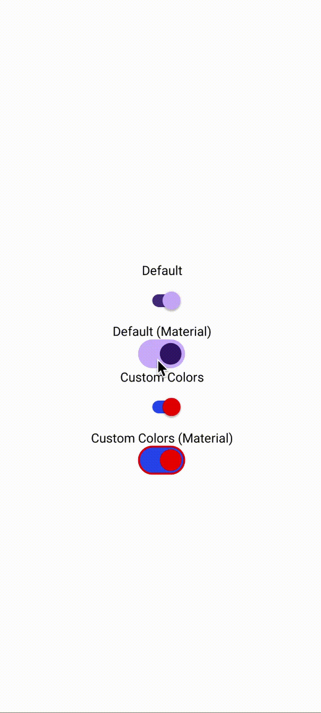
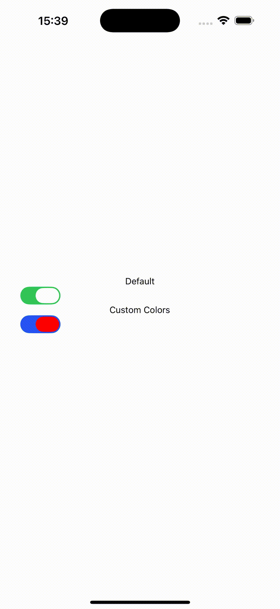

# react-native-nitro-switch

react-native-nitro-switch is a react native package built with Nitro

[](https://www.npmjs.com/package/react-native-nitro-switch)
[](https://www.npmjs.com/package/react-native-nitro-switch)
[](https://github.com/patrickkabwe/react-native-nitro-switch/LICENSE)

## Demo

<p>
  
  
</p>

## Requirements

- React Native v0.76.0 or higher
- Node 18.0.0 or higher

> [!IMPORTANT]  
> To Support `Nitro Views` you need to install React Native version v0.78.0 or higher.

## Installation

```bash
npm install react-native-nitro-switch react-native-nitro-modules
```

## Usage

```ts
import Switch from 'react-native-nitro-switch';
import { View } from 'react-native';
import React, { useState } from 'react';

export default function App() {
  const [isEnabled, setIsEnabled] = useState(false);

  return (
    <View style={{ padding: 20 }}>
      <Switch
        value={isEnabled}
        onValueChange={setIsEnabled}
        thumbColor={{ on: '#fff', off: '#ccc' }}
        trackColor={{ on: '#34c759', off: '#e5e5ea' }}
        design="material"
      />
    </View>
  );
}
```

### Android Styling

If you'd like to use the Material design switches, your app theme must inherit from:

```xml
<style name="AppTheme" parent="Theme.Material3.DayNight.NoActionBar" />
```

in your **styles.xml** file.

Styling of the switch on Android can be customized more deeply by modifying your app theme or overriding the Material3 attributes.

You can define your own colors, thumb, and track styles directly in XML or by creating a custom theme that inherits from `Theme.Material3.DayNight.NoActionBar`.

The color properties defined in XML cannot be changed at runtime, and any modification requires rebuilding the app.

For more information, see the official [MDC-Android](https://github.com/material-components/material-components-android/blob/master/docs/components/Switch.md).


## API Reference

| Prop | Type | Default | Required | Platform | Description |
|------|------|----------|-----------|-----------|-------------|
| **value** | `boolean` | — | ✅ | All | Determines whether the switch is on (`true`) or off (`false`). |
| **onValueChange** | `(value: boolean) => void` | — | ❌ | All | Callback invoked when the switch value changes. |
| **disabled** | `boolean` | `false` | ❌ | All | Disables user interaction when set to `true`. |
| **thumbColor** | `{ on: string; off: string } \| string` | Platform default | ❌ | All | Color of the thumb in on/off states. Accepts color names (`'red'`), hex (`'#FF0000'`), rgb, rgba, or hsl. |
| **trackColor** | `{ on: string; off: string } \| string` | Platform default | ❌ | All | Background track color for on/off states. |
| **trackDecorationColor** | `{ on: string; off: string } \| string` | Platform default | ❌ | **Android only** | Optional decoration or border color for the track. |
| **style** | `ViewStyle` | — | ❌ | All | Custom style applied to the container. |
| **design** | `"default"` \| `"material"` | `"default"` | ❌ | **Android only** | Switch design style. `"material"` uses Android’s Material You Switch. |


## Credits

Bootstrapped with [create-nitro-module](https://github.com/patrickkabwe/create-nitro-module).

## Contributing

Pull requests are welcome. For major changes, please open an issue first to discuss what you would like to change.
